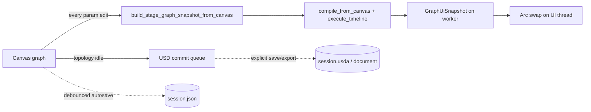

# MarketLab — Project Status

**Date:** 2026-06-04  
**Crates:** `pulsar_marketlab` (app), `pulsar_marketlab_core` (engine), `pulsar_marketlab_ui` (GPUI workstation)  
**UI framework:** GPUI 0.2 workstation layout  

---

## Executive Summary

MarketLab is a Rust/GPUI portfolio backtest workstation. The graph engine runs **full historical sweeps** (`execute_timeline`) over wired Asset → TA → Portfolio pipelines. Interactive playhead scrubbing was removed (SRD v10.0). **Double-buffer UI isolation (v7.0)** and **OpenUSD diff-commit boundary (v9.0)** decouple engine sweeps from GPUI apply and from per-edit USDA roundtrips.

---

## Architecture

| Layer | Role |
|-------|------|
| **Canvas** | `VisualNode` graph; debounced USD commit (500ms); interaction gating during drag/TA scrub |
| **Graph engine** | `build_stage_graph_snapshot_from_canvas` → compile + sweep; cached engine when topology generation stable |
| **UI double-buffer** | `Arc<GraphUiSnapshot>` built in graph-engine worker; UI reads via `ui_read_snapshot()` |
| **OpenUSD** | Import/save/export interchange; **not** on sweep/autosave hot path (Track A) |
| **Bottom panel** | USD layer stack + logical strategy hierarchy (no timeline matrix) |
| **Persistence** | Session JSON debounced autosave; USDA on explicit flush / export only |



---

## Completed phases

| Phase | SRD | Summary |
|-------|-----|---------|
| Zero-copy columns | — | `SharedPriceColumn`, full-range sweeps |
| Parallel tier sweep | OTL Phase 2 | Rayon tier execution, engine cache |
| UI debouncing | v5.0 | 500ms pipeline debounce, interaction deferral |
| Dopesheet clipping | v6.0 | Viewport clip, semantic USD paths |
| Playhead removal | v10.0 | Full-range only; layer stack + strategy tree |
| Double-buffer | v7.0 | `GraphUiSnapshot` / `TimelineUiSnapshot` Arc swap |
| USD boundary | v9.0 | Canvas compile; TA param skip USD; split invalidation |
| Track A lean runtime | — | Direct canvas→snapshot sweeps; JSON autosave; USDA export-only on hot path |

---

## Test matrix

Run at ledger update time:

```bash
cargo check -p pulsar_marketlab
cargo test -p pulsar_marketlab canvas_compose::
cargo test -p pulsar_marketlab canvas_graph_snapshot::perf_tests -- --nocapture
cargo test --test perf_test -- --nocapture
cargo test -p pulsar_marketlab_core codegen_spec::
```

| Test | Proves |
|------|--------|
| `perf_engine_canvas_direct` | Canvas → compile → sweep (engine healthy) |
| `perf_engine_usd_roundtrip` | Production USDA compose + open overhead |
| `perf_usd_compose_only` | String compose cost in isolation |

Default fixture: **6 assets × 2872 bars**. Optional: `RISKPARITY_PORTFOLIO_DIR` for local CSV profiling (skipped in CI if unset).

---

## Active roadmap

1. **Tier hardening (v8.0)** — signal tier errors passthrough upstream (no silent zero-fill); parallel/sequential equivalence test in core
2. **Persistent in-memory USD stage (v9 Phase B)** — eliminate repeated `Stage::open` on structural queries
3. **New time-navigation viewport** — post-playhead clean slate
4. **Logical topology from canvas snapshot** — dopesheet tree without live stage walk

---

## Key files

| Area | Path |
|------|------|
| Graph engine worker | `crates/pulsar_marketlab_ui/src/workspace/graph_engine.rs` |
| UI snapshot | `crates/pulsar_marketlab/src/graph_ui_snapshot.rs` |
| Canvas compile | `crates/pulsar_marketlab/src/canvas_graph_snapshot.rs` |
| Workspace apply | `crates/pulsar_marketlab/src/workspace_state.rs` |
| Perf tests | `crates/pulsar_marketlab/tests/perf_test.rs` |
