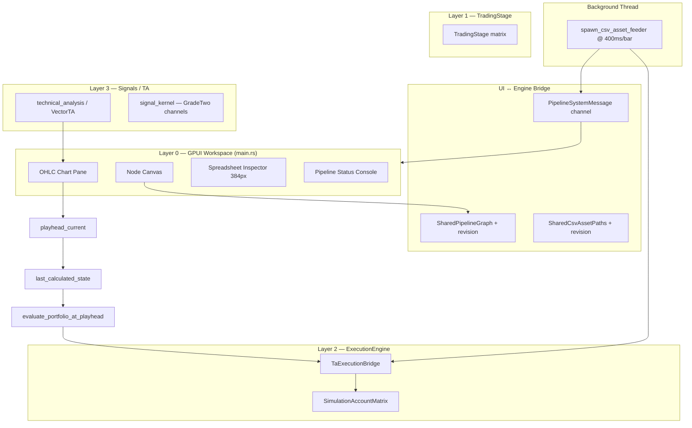

# MarketLab — Project Status

**Audience:** Developers and AI architectural agents  
**Date:** 2026-05-24  
**Phase alignment:** Phase A (Core Functional Backbone) — in progress  
**Primary crate:** `crates/pulsar_marketlab`  
**UI framework:** GPUI v0.2.2  

---

## 1. Executive Summary

MarketLab is a Rust/GPUI workstation for composing visual pipelines (Asset → Technical Analysis → Portfolio) backed by a layered computation stack. Phase A focuses on stabilizing the end-to-end path from canvas wiring through CSV replay to portfolio analytics.

The system is **functional for single-asset Yahoo CSV replay** with RSI-driven simulated trades, multi-wire Portfolio inputs, synchronized chart playhead scrubbing, and cached portfolio evaluation. The visual graph now drives backend calculations through `TaExecutionBridge` without legacy Signal/Bivector node types.

**Build health:** `cargo check` clean (no warnings). **19/19** library unit tests passing. `main.rs` remains a monolithic binary (~4.7k lines) with no GPUI unit tests.

---

## 2. Layered Architecture



| Layer | Module | Role |
|-------|--------|------|
| **0 — UI** | `main.rs`, `ohlc_chart_pane.rs`, `asset_path_input.rs` | Node canvas, wiring, inspector, OHLC chart, portfolio panels, status console |
| **Bridge** | `SharedPipelineGraph`, `SharedCsvAssetPaths`, `PipelineSystemMessage` | Cross-thread graph state, CSV path registry, message bus |
| **1 — Stage** | `trading_stage/` | Dense tick matrix, serde wire format |
| **2 — Execution** | `execution_engine/` | Cash/asset ledger, tracking matrix, transaction apply |
| **3 — Signals** | `signal_kernel/`, `technical_analysis.rs` | Grade-channel kernel; RSI/MACD/ADX VectorTA wrappers |
| **Feeder** | `spawn_csv_asset_feeder` in `main.rs` | Sequential CSV replay (sole runtime data stream) |

---

## 3. Current UI Layout

```
┌─────────────────────────────────────────────┬──────────────────┐
│  OHLC Chart Pane (flex 1)                   │  Spreadsheet     │
│  — candlesticks, TA overlays, playhead      │  Inspector       │
├─────────────────────────────────────────────┤  (384px)         │
│  Node Canvas (flex 1)                       │  — asset config  │
│  — drag, wire, pan/zoom, context menu       │  — TA picker     │
│                                             │  — portfolio     │
├─────────────────────────────────────────────┤    analytics     │
│  Pipeline Status Console (144px, full width)│                  │
└─────────────────────────────────────────────┴──────────────────┘
```

**Not implemented (reverted):** Three-column workspace shell (240px project tree | center stack | 384px inspector) and timeline sequencer panel. An attempt was made and rolled back — see backlog item below.

---

## 4. Default Pipeline State

**Graph topology (startup):**

```
Node 1 (Asset: SPY.csv) ──► Node 2 (TA: RSI) ──► Node 4 (Sim Portfolio)
```

- No Signal/Bivector node types in UI or default graph.
- Portfolio exposes dynamic input ports: **"Signal In 0"**, **"Signal In 1"**, … (auto-expands on wire commit).
- Duplicate TA→Portfolio wires from the same source are rejected.
- Valid connections: Asset→TA, TA→Portfolio, Asset→Portfolio.
- `SharedPipelineGraph.revision` increments on every graph sync (wire/node changes).

**Simulation constants:**

| Constant | Value | Notes |
|----------|-------|-------|
| `SIM_INITIAL_CASH` | $10,000 | Epoch baseline |
| `SIM_DEPLOY_FRACTION` | 0.95 | RSI buy deploys 95% of cash |
| `CSV_PLAYBACK_INTERVAL` | 400ms | Per-bar step during replay |
| `TA_RSI_OVERSOLD/OVERBOUGHT` | 30 / 70 | Cross triggers SIM trades |
| `CSV_EXECUTION_TIMELINE_CAP` | 4096 | Execution engine timeline bound |

---

## 5. Data Flow & Message Bus

### `PipelineSystemMessage` variants

| Message | Producer | Consumer effect |
|---------|----------|-----------------|
| `TickUpdate` | CSV feeder | Inspector rows, node card sparklines |
| `ChartSeriesPreload` | CSV init/hot-swap | Full OHLC + close history; resets playhead to 0 |
| `PlayheadSet` | CSV feeder | Updates `playhead_current`; triggers portfolio re-eval |
| `PortfolioMetrics` | Baseline publish at replay start | Portfolio card (partially superseded by playhead eval) |
| `ResetSimulation` | Replay restart | Epoch counter bump |
| `StatusAlert` | Feeder, SIM trades | Bottom status console |

### CSV replay model

- **Play once, pause at EOF** — not an infinite loop.
- **Replay triggers:** graph wiring change (`SharedPipelineGraph.revision`), CSV path change (`SharedCsvAssetPaths.revision`), asset attach/hot-swap.
- During playback: `PlayheadSet` advances each bar.

### Playhead, scrubbing, and cached evaluation

- Global `playhead_current` / `playhead_total_bars` in `TradingSystemWorkspace`.
- Amber vertical playhead line in `ohlc_chart_pane.rs` (`0xf59e0b`, 1.5px).
- Click/drag scrubbing on OHLC pane maps mouse X → bar index.
- **`last_calculated_state: (playhead_current, graph_revision)`** — short-circuits `evaluate_portfolio_at_playhead` when neither playhead nor wiring changed (fixes Sharpe jitter).
- Cache invalidated on wire commit and node spawn.
- **`evaluate_portfolio_at_playhead`** — ephemeral replay from bar 0 through playhead using a fresh `TaExecutionBridge`; only TA nodes wired to Portfolio are included via `portfolio_wired_ta_node_ids` filter. Returns baseline metrics when no portfolio wires exist.

### Engine consolidation

- **`spawn_pipeline_engine_feeder` removed.** Single deterministic CSV playback thread drives all runtime ticks.
- `TaExecutionBridge` maps VectorTA indicator values directly to RSI cross transaction boundaries — no intermediate geometric transform path in the UI loop.

---

## 6. Portfolio Analytics

Metrics computed in `compute_metrics_from_nav_history`:

| Metric | Description |
|--------|-------------|
| **R_total** | Strategy return vs $10k initial |
| **Buy & Hold benchmark** | Same-window asset return (first→last bar close) |
| **Alpha (α vs B&H)** | Strategy minus benchmark |
| **MDD** | Max drawdown on NAV path |
| **Sharpe** | Annualized from period returns (√252), not dollar deltas |
| **Activity** | Bars processed · trade count · avg exposure |

**Known limitations:**

- Single shared execution engine (one asset channel) — not true multi-asset portfolio aggregation.
- Short CSVs (e.g. 9-row SPY sample) often produce 0 RSI crosses → 0 trades → negative alpha vs rising B&H (expected behavior).
- **`-100% R_total`** on longer series reported in testing — likely ledger/tick-index bug in `evaluate_portfolio_at_playhead`; **open investigation**.
- `PortfolioMetrics` channel partially redundant with playhead-local evaluation.

---

## 7. Completed Work (Recent Sprints)

### System Stabilization
- [x] Default graph: Asset → RSI → Portfolio (no Signal node)
- [x] Context menu: Spawn Asset / TA / Portfolio
- [x] Portfolio multi-wire with dynamic **Signal In N** ports
- [x] CSV EOF: pause + reset epoch (no blind infinite loop)
- [x] Replay-on-change (graph revision + CSV path revision)

### UI Interaction & Engine Compilation Alignment
- [x] Remove `spawn_pipeline_engine_feeder` (single CSV stream)
- [x] Strip Bivector/Signal node types from UI; `GradeChannel::Bivector` renamed to `GradeTwo` in `signal_kernel`
- [x] Direct TA→execution routing via `TaExecutionBridge`
- [x] Cached playhead evaluation (`last_calculated_state`)
- [x] Portfolio baseline when no wires connected
- [x] Dead-code cleanup (unused graph traversal helpers)

### Portfolio Analytics Upgrade
- [x] B&H benchmark + alpha
- [x] Trade count, bars processed, avg exposure
- [x] Sharpe on percent returns
- [x] 95% cash deploy on RSI buy; full flatten on sell

### Synchronized Playhead & Scrubbing
- [x] Playhead rendering + coordinate helpers in `ohlc_chart_pane.rs`
- [x] Mouse scrub on OHLC pane
- [x] `evaluate_portfolio_at_playhead` — no NAV history drift
- [x] `PlayheadSet` wired through CSV feeder
- [x] Chart flex layout fix (candlesticks collapsing to zero height)

---

## 8. Open Issues & Technical Debt

### P0 — Correctness
| Issue | Status |
|-------|--------|
| Portfolio `-100%` / broken final analytics on longer CSV | **Open** — trace ledger replay at playhead == last bar |
| Visual graph → `ExecutionGraph::compile_graph` | **Not wired** — evaluation is ad-hoc replay, not compiled DAG |
| Wire deletion UX | **Partial** — no dedicated disconnect gesture; graph revision + cache invalidation ready when added |

### P1 — UX / Interaction
| Issue | Status |
|-------|--------|
| Playhead scrub hit-test uses wrapper bounds | May misalign vs plot inset |
| No manual "Replay" button | Replay only on graph/CSV change |
| Status console only | No timeline sequencer / project tree (shell refactor reverted) |

### P2 — Architecture
| Issue | Notes |
|-------|-------|
| `main.rs` monolith | ~4.7k lines; split into `workspace/`, `feeders/`, `portfolio_metrics/` |
| No graph JSON persistence | Graph lost on restart |
| No unit tests for playhead eval / metrics | Logic trapped in binary crate |
| `PortfolioMetrics` vs playhead eval duplication | Consolidate to single analytics path |

---

## 9. SRD / Rule Document Index

| Document | Scope | Status |
|----------|-------|--------|
| `System Stabilization.md` | Default graph, wiring, drift fix | **Done** |
| `UI Interaction & Engine Compilation Alignment.md` | Cached eval, bivector removal, single feeder | **Done** |
| `Synchronized Chart Playhead & Scrubbing.md` | Playhead, scrub, bounded eval | **Done** |
| `marketlab_srd_1.md` | Node canvas drag, ports | Mostly done |
| `MarketLab Long-Term Architectural Strategy.md` | Phases A–D roadmap | Phase A active |
| Workspace shell SRD (3-column + timeline) | Layout refactor | **Reverted** — do not re-apply without revised spec |
| `Agent A/B/C *.md` | UI, graphics, ingestion upgrades | Backlog |
| `Graphics Update charting engine.md` | Chart engine upgrades | Backlog |

---

## 10. Recommended Next Steps

### Immediate (Phase A completion)
1. **Debug `-100% R_total`** — trace cash/qty/NAV per tick in `evaluate_portfolio_at_playhead`; verify tick index vs `CSV_EXECUTION_TIMELINE_CAP`.
2. **Unify analytics path** — remove redundant `PortfolioMetrics` publishes; single source from playhead evaluation.
3. **Wire disconnect** — add gesture to remove connections; verify metrics drop to baseline instantly.
4. **Extract modules from `main.rs`** — `pipeline_messages.rs`, `csv_feeder.rs`, `portfolio_diagnostics.rs`, `workspace.rs`.

### Near-term (Phase A → B bridge)
5. **Compile visual graph to execution plan** — map `NodeConnection` list → ordered evaluation DAG.
6. **Multi-asset portfolio** — per-asset ledger channels or weighted NAV aggregation.
7. **Graph persistence** — serialize `VisualNode` + `NodeConnection` to JSON.
8. **Workspace shell (revised)** — if desired, re-specify 3-column layout with acceptance criteria before re-implementation.

### Long-term (Phases B–D)
9. USD stage time-sampling (Phase B)  
10. OSL-inspired signal DSL → `signal_kernel` (Phase C)  
11. Hydra delegate for 3D risk/performance viz (Phase D)  

---

## 11. Key File Map

```
crates/pulsar_marketlab/
├── src/
│   ├── main.rs              # UI workspace, CSV feeder, graph, playhead, analytics (~4.7k LOC)
│   ├── ohlc_chart_pane.rs   # Candlestick + TA overlays + playhead line
│   ├── asset_path_input.rs  # CSV path editor widget
│   ├── execution_engine/    # Layer 2 ledger + tracking matrix (7 tests)
│   ├── technical_analysis.rs# VectorTA indicator registry + compute (5 tests)
│   ├── signal_kernel/       # Layer 3 grade-channel kernel (7 tests)
│   ├── trading_stage/       # Layer 1 dense matrix
│   └── lib.rs
└── data/
    └── SPY.csv              # 9-row sample; users bind longer Yahoo CSVs
```

---

## 12. Test & Verification Status

- **Unit tests:** 19 passing in `lib` modules
- **Integration / UI tests:** None
- **Manual verification checklist:**

| Check | Expected |
|-------|----------|
| Select SPY asset | OHLC candlesticks visible + amber playhead |
| Scrub playhead | Portfolio metrics change; Sharpe **static** when playhead stops |
| Wire second TA → Portfolio | Second **Signal In N** port appears |
| Remove TA→Portfolio wire | Metrics drop to baseline (when disconnect UX exists) |
| CSV EOF | Playback pauses; change graph → replay from bar 0 |
| Final bar analytics | Sane values (not −100% unless legitimate wipeout) |
| `cargo check -p pulsar_marketlab` | Clean, no warnings |
| `grep -i bivector src/` | Zero matches |

---

*Update this document after major architectural changes or Phase A sign-off.*
