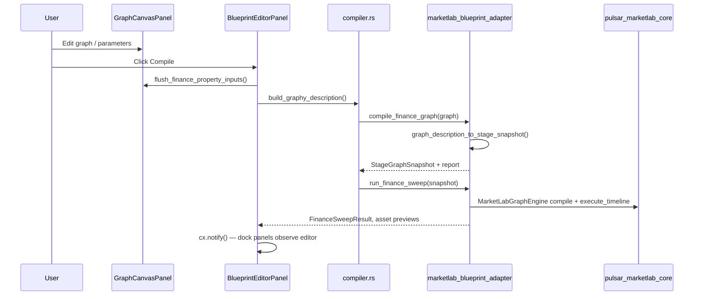

# MarketLab GUI Refactor — Architecture & Implementation Brief

**Audience:** AI agents and engineers refactoring the MarketLab user interface  
**Status:** Canonical handoff document (June 2026)  
**Repo:** [MarketLab](https://github.com/joeff/MarketLab) (local path: `MarketLab/`)  
**Ground truth:** `crates/` source wins over `.cursor/rules/` when they disagree  

---

## 1. Purpose of this document

This brief explains:

1. **Which GUI stack to use** (and which stacks to **reject**).
2. **How OpenUSD fits** philosophically and as persistence — and why it must **not** sit on the interactive or compile hot path.
3. **How the Pulsar Blueprint editor stack** (`Plugin_Blueprints` + WGPUI + Graphy) connects to the MarketLab engine.
4. **Where to edit code** for a GUI refactor without breaking sweeps, path identity, or schema contracts.

Read this before choosing frameworks, moving compile logic, or reintroducing USD into per-frame UI loops.

---

## 2. Executive summary

MarketLab is a **Rust desktop quantitative workbench**. Users author **node graphs** (assets → analytics/OTL → portfolios), **compile** them into an engine snapshot, and **run full-timeline backtest sweeps**.

| Concern | Technology | Role |
|--------|------------|------|
| **Structural truth (philosophy + interchange)** | OpenUSD `.usda` via [`openusd` 0.3.0](https://github.com/mxpv/openusd) | Schema, prim paths, relationships, layer stack, save/export |
| **Interactive authoring UI (target)** | **WGPUI** + **Plugin_Blueprints** | Node canvas, inspectors, docking, compile toolbar |
| **Graph IR** | **Graphy** `GraphDescription` | Serializable graph between UI and adapter |
| **Engine bridge** | `marketlab_blueprint_adapter` | Graphy → `StageGraphSnapshot` → sweep |
| **Execution** | `pulsar_marketlab_core` | `MarketLabGraphEngine`, vectorized OTL, portfolio integration |
| **Legacy UI (deprecated)** | GPUI 0.2.2 + `pulsar_marketlab_ui` | Original DCC workstation; do not extend for new finance work |

**Central rule:** OpenUSD is the **authoritative vocabulary and persistence format** for strategy topology. The **interactive loop** and **compile/sweep loop** operate on **in-memory snapshots** (`StageGraphSnapshot`, OHLC vectors, sweep results). USD is invoked only when needed: **import, save, export, resource resolve, taxonomy sidecars** — not on every parameter tweak or compile.

---

## 3. GUI frameworks — use this, not that

### 3.1 ✅ Canonical stack (Track B — finance editor)

| Component | Repository | Crate / package | Notes |
|-----------|------------|-----------------|-------|
| Blueprint node editor | [Far-Beyond-Pulsar/Plugin_Blueprints](https://github.com/Far-Beyond-Pulsar/Plugin_Blueprints) | `blueprint_editor_plugin` | Vendored under `external/Plugin_Blueprints`; patched via `scripts/patches/plugin_blueprints_marketlab_finance.patch` |
| UI runtime (GPUI fork) | [Far-Beyond-Pulsar/WGPUI](https://github.com/Far-Beyond-Pulsar/WGPUI) | `gpui-ce` | **Not** crates.io `gpui` — pinned git rev in `Plugin_Blueprints/Cargo.toml` |
| UI components | [Far-Beyond-Pulsar/WGPUI-Component](https://github.com/Far-Beyond-Pulsar/WGPUI-Component) | `ui` | Docking, inputs, theme, panels |
| Graph IR | [Far-Beyond-Pulsar/Graphy](https://github.com/Far-Beyond-Pulsar/Graphy) | `graphy` | `GraphDescription`, node metadata |
| Game/editor shared libs | [Far-Beyond-Pulsar/Pulsar-Native](https://github.com/Far-Beyond-Pulsar/Pulsar-Native) | `plugin_editor_api`, `ui_common`, `pulsar_std`, … | Reflection, property panels |
| Bytecode (non-finance modes) | [Far-Beyond-Pulsar/PBGC](https://github.com/Far-Beyond-Pulsar/PBGC) | `pbgc` | Unused in `CompileMode::MarketLabFinance` |
| Finance host binary | *this repo* | `marketlab_finance_editor` | Thin `main.rs` — sets `CompileMode::MarketLabFinance` |
| Engine adapter | *this repo* | `marketlab_blueprint_adapter` | Graphy → snapshot → sweep |

**Entry point:**

```powershell
.\scripts\setup_pulsar_external.ps1   # clone externals + apply patches (once)
.\scripts\run_finance_editor.ps1        # recommended launch
```

Equivalent:

```powershell
cargo run --manifest-path crates/marketlab_finance_editor/Cargo.toml
```

`marketlab_finance_editor` is **excluded** from the root `Cargo.toml` workspace (separate `Cargo.lock`) because of a `tree-sitter` version conflict between WGPUI and legacy `gpui-component`. Both builds share `target/` via `external/Plugin_Blueprints/.cargo/config.toml`.

### 3.2 ⚠️ Legacy stack (Track A — do not extend)

| Component | Version | Location |
|-----------|---------|----------|
| GPUI | `0.2.2` (crates.io) | `pulsar_marketlab`, `pulsar_marketlab_ui` |
| gpui-component | `0.5.1` | Stage composer, OTL editor shell, node canvas frame |

Binary: `cargo run -p pulsar_marketlab`  
This is the original **usdtweak-inspired DCC workstation** (stage tree, layer stack, param inspector). It remains useful as reference but **new finance GUI work targets Track B**.

### 3.3 ❌ Do not introduce

| Framework | Why |
|-----------|-----|
| **egui / eframe** | Parallel UI stack; no docking/graph integration |
| **iced / slint / dioxus** | Not part of Pulsar ecosystem |
| **Crates.io `gpui` in Plugin_Blueprints** | Trait mismatch with WGPUI (`gpui-ce`) |
| **Qt / Electron / web SPA** | Out of scope; engine is native Rust |
| **C++ OpenUSD** | Project uses pure-Rust `openusd` only |
| **Re-merging `marketlab_finance_editor` into root workspace** | Blocked on `tree-sitter` 0.25 vs 0.26 until dependency alignment |

If you need a new panel, **extend Plugin_Blueprints** (patched copy) or add a thin host in `marketlab_finance_editor` — do not start a third UI crate.

---

## 4. OpenUSD — philosophy, persistence, and boundaries

### 4.1 What USD means in MarketLab

OpenUSD is the **scene-graph mental model** for trading pipelines:

- **Prims** = nodes (`FinancialAsset`, `OtlTaUberSignal`, `PortfolioIntegrator`, …)
- **Relationships** = wires (`inputs:underlying`, `inputs:sources`)
- **Attributes** = parameters (`inputs:symbol`, `inputs:period`, `ui:canvas:pos`, `info:user_label`)
- **Layers** = session vs signals vs read-only universe taxonomy

USD answers: *what exists, how it is wired, what the schema defaults are, and what we persist to disk.*

See also: [`docs/architecture/openusd_integration.md`](openusd_integration.md).

### 4.2 What USD is **not** (performance contract)

USD must **not** participate in:

| Hot path | Why |
|----------|-----|
| Per-frame UI render | `openusd::Stage` is `!Send` / `!Sync` in 0.3.0; reopen-per-query is for infrequent structural reads |
| **Compile / sweep loop** | Engine runs on `StageGraphSnapshot` + `HashMap<prim_path, Vec<f64>>` — not live stage time samples |
| Writing millions of OHLC samples into USD layers | Temporal data lives in CSV loaders, `MarketStage`, and in-memory vectors |
| Autosave on every canvas drag | Debounced JSON (legacy) or explicit save (finance JSON); USDA on export/commit boundaries |

**Philosophy:** USD is **truth on disk and interchange**; RAM snapshots are **truth at runtime**.

### 4.3 When the UI **does** call USD

| Operation | Track A (legacy) | Track B (finance editor) |
|-----------|------------------|---------------------------|
| **Compose canvas → USDA** | `canvas_compose.rs` → `publish_canvas_to_usd_stage` | *Planned / export path* — compile uses Graphy → adapter, **not** live stage |
| **Hydrate USDA → canvas** | `canvas_hydrate.rs` | Future: import pipeline |
| **Save session** | Debounced `session.json` + explicit `.usda` export | `graph_save.json` via `Plugin_Blueprints/src/io/save_load.rs` |
| **Schema / taxonomy** | Embedded `schema.usda`, `metadata_library.usda` | Same schema via `marketlab_blueprint_adapter` prim mapping |
| **Resource resolve** | `taxonomy.rs` flattens GICS/ETF metadata at compose time | `asset_data.rs` resolves CSV paths for OHLC preview + sweep |

### 4.4 Structural vs temporal vs engine (three planes)

```
┌─────────────────────────────────────────────────────────────────────────┐
│  STRUCTURAL PLANE (OpenUSD)                                              │
│  • schema.usda classes, prim paths, relationships                        │
│  • Layer stack, info:user_label, ui:canvas:pos                           │
│  • Import / save / export / taxonomy resolve                             │
│  • NOT on compile or render hot path                                     │
└───────────────────────────────┬─────────────────────────────────────────┘
                                │  explicit I/O only
                                ▼
┌─────────────────────────────────────────────────────────────────────────┐
│  SNAPSHOT PLANE (in-memory, compile input)                               │
│  • StageGraphSnapshot { prims, wires, path_bindings, asset_registry }    │
│  • Built from canvas (Track A) OR Graphy graph (Track B)                 │
│  • OHLC: HashMap<String, Vec<f64>> keyed by prim path                    │
└───────────────────────────────┬─────────────────────────────────────────┘
                                │  compile_from_stage + execute_timeline
                                ▼
┌─────────────────────────────────────────────────────────────────────────┐
│  EXECUTION PLANE (MarketLabGraphEngine)                                  │
│  • Full-timeline vector sweeps, portfolio wealth series                  │
│  • ComputedAttributeStream → UI caches (not written back to USD)         │
│  • MarketStage + ProductionStageProvider (legacy playhead OTL only)      │
└─────────────────────────────────────────────────────────────────────────┘
```

**Track A lean runtime (current legacy direction):** `canvas_graph_snapshot.rs` builds `StageGraphSnapshot` **directly from canvas** with **no USDA round-trip** on sweep. USD commit is debounced (~500ms) and autosave is JSON; USDA is export-oriented on the hot path.

**Track B (finance editor):** `graph_description_to_stage_snapshot()` in `marketlab_blueprint_adapter` builds the same snapshot type from Graphy — **never opens a USD stage during Compile**.

---

## 5. Pulsar Blueprint stack — architecture

### 5.1 Repository layout

```
MarketLab/
├── crates/
│   ├── pulsar_marketlab_core/      # Engine only (no UI)
│   ├── marketlab_blueprint_adapter/ # Graphy ↔ engine bridge
│   ├── marketlab_finance_editor/   # Track B binary (separate lockfile)
│   ├── pulsar_marketlab/           # Track A app (legacy)
│   └── pulsar_marketlab_ui/        # Track A workstation widgets
├── external/                       # gitignored clones
│   ├── Plugin_Blueprints/          # blueprint_editor_plugin
│   └── Graphy/
├── scripts/
│   ├── setup_pulsar_external.ps1
│   ├── apply_plugin_blueprints_patches.ps1
│   ├── run_finance_editor.ps1
│   └── patches/plugin_blueprints_marketlab_finance.patch
└── docs/architecture/
    ├── openusd_integration.md
    └── gui_refactor_brief.md          # this file
```

### 5.2 Plugin_Blueprints internal map (finance-relevant)

| Area | Path under `external/Plugin_Blueprints/` |
|------|------------------------------------------|
| Compile modes | `src/core/types.rs` — `CompileMode::MarketLabFinance` |
| Finance compile + sweep | `src/features/compilation/compiler.rs` — `compile_to_finance_snapshot()` |
| Editor state | `src/editor/panel.rs` — `last_finance_sweep`, `last_finance_asset_previews`, … |
| Workspace / docking | `src/editor/workspace.rs` |
| Canvas + property flush | `src/editor/workspace_panels.rs` — `GraphCanvasPanel`, `flush_finance_property_inputs` |
| Node graph render/input | `src/rendering/graph.rs`, `src/rendering/input.rs` |
| Properties inspector | `src/ui_components/properties.rs` |
| OHLC preview panel | `src/ui_components/finance_ohlc_chart.rs` |
| Wealth chart panel | `src/ui_components/finance_wealth_chart.rs` |
| Save / open | `src/io/save_load.rs` — `graph_save.json` |
| Node definitions | `src/core/definitions.rs` — merges `finance_property_defaults` |
| Palette | `src/ui_components/palette_view.rs` — finance catalog when `MarketLabFinance` |

Patches are **not** committed inside `external/`; they live in `scripts/patches/`. After editing Plugin_Blueprints:

```powershell
cd external/Plugin_Blueprints
git add -A
git diff --cached HEAD > ../../scripts/patches/plugin_blueprints_marketlab_finance.patch
```

### 5.3 Finance editor — end-to-end compile flow



**Key files:**

| Step | File |
|------|------|
| Graph export | `Plugin_Blueprints` → `BlueprintEditorPanel::build_graphy_description()` |
| Snapshot | `crates/marketlab_blueprint_adapter/src/snapshot.rs` |
| Compile report | `crates/marketlab_blueprint_adapter/src/compile.rs` |
| CSV / OHLC load | `crates/marketlab_blueprint_adapter/src/asset_data.rs` |
| Sweep | `crates/marketlab_blueprint_adapter/src/sweep.rs` |
| Engine | `crates/pulsar_marketlab_core/src/orchestration/engine.rs` |

**No USD `Stage::open` anywhere in this loop.**

### 5.4 Legacy workstation — end-to-end flow (reference)

```
Canvas (VisualNode[]) 
  → sync_pipeline_graph() 
  → build_stage_graph_snapshot_from_canvas()   # no USDA round-trip
  → MarketLabGraphEngine (background worker)
  → GraphUiSnapshot Arc swap to GPUI thread

Parallel (debounced, not per-compile):
  → compose_pipeline_usda() → ManagedUsdStage reload
  → session.json autosave
  → explicit .usda export on user action
```

| Step | File |
|------|------|
| Canvas → snapshot (fast path) | `crates/pulsar_marketlab/src/canvas_graph_snapshot.rs` |
| Canvas → USDA (persistence) | `crates/pulsar_marketlab/src/canvas_compose.rs` |
| Incremental USD sync | `crates/pulsar_marketlab/src/canvas_stage_sync.rs` |
| Workspace hub | `crates/pulsar_marketlab/src/workspace_state.rs` |
| Graph engine worker | `crates/pulsar_marketlab_ui/src/workspace/graph_engine.rs` |
| USD stage authority | `crates/pulsar_marketlab_ui/src/workspace/context.rs` |

---

## 6. Node taxonomy and schema contract

Finance nodes use Graphy `node_type` strings mapped to USD `typeName` values:

| Tier | Graphy `node_type` | USD `typeName` | Category |
|------|-------------------|----------------|----------|
| Universe | `marketlab.universe.financial_asset` | `FinancialAsset` | Universe |
| Analytics | `marketlab.analytics.otl_operator` | `OtlOperator` | Analytics |
| Analytics | `marketlab.analytics.ta_*` | `OtlTaUberSignal` | Analytics |
| Portfolio | `marketlab.portfolio.integrator` | `PortfolioIntegrator` | Portfolios |

Source: `crates/marketlab_blueprint_adapter/src/types.rs`  
Schema: `crates/pulsar_marketlab_core/resources/usd/schema.usda`  
Taxonomy sidecar: `crates/pulsar_marketlab_core/resources/usd/metadata_library.usda`

### Prim path conventions

| Node kind | Default prim path |
|-----------|-------------------|
| Financial asset | `/MarketLab/Universe/{SYMBOL}` |
| TA / OTL analytics | `/MarketLab/Analytics/{node_id}` |
| Portfolio | `/MarketLab/Portfolios/{name}` |

Paths must remain **stable** across compose → compile → chart binding. Breaking path identity breaks `asset_vectors[prim_path]` lookups.

### Wiring (relationships)

| Edge | USD relationship |
|------|------------------|
| Asset → analytics | `inputs:underlying` |
| Asset / analytics → portfolio | `inputs:sources` |
| Analytics chain | `inputs:sources` or `inputs:underlying` |

---

## 7. Persistence models

| Format | Used by | Contents | When written |
|--------|---------|----------|--------------|
| **`graph_save.json`** | Finance editor | Full Graphy/canvas graph, tabs, layout | User Save / Open |
| **`session.json`** | Legacy app | Workspace session state | Debounced autosave |
| **`.usda`** | Both (intended) | Structural topology, schema, relationships | Explicit export/save; debounced compose (legacy) |
| **Bundled CSV** | Engine + OHLC UI | `crates/pulsar_marketlab/data/{SYMBOL}.csv` | Shipped with repo |
| **`finance_stage_snapshot.txt`** | Debug | Text dump after finance compile | Optional debug artifact |

**Refactor guidance:** Treat **Graphy graph JSON** as the finance editor's working document. **USD export** should remain an explicit interchange step (File → Export USDA), not a prerequisite to Compile.

---

## 8. Finance editor UI inventory

### 8.1 Dock layout (post-patch)

| Region | Panel | Data source |
|--------|-------|-------------|
| Center | `GraphCanvasPanel` | Live graph |
| Right | Properties / sweep summary | `last_finance_sweep`, node selection |
| Bottom | **Asset OHLC** | Selected `FinancialAsset` + `last_finance_asset_previews` / CSV loader |
| Bottom | **Wealth Chart** | `last_finance_sweep.portfolios` |
| Bottom | Compiler / Find | Compilation history |

### 8.2 Panel refresh contract

Dock panels (`FinanceOhlcChartPanel`, `FinanceWealthChartPanel`) must **observe** `BlueprintEditorPanel` and repaint when:

- Compile completes (`cx.notify()` on editor)
- Canvas selection changes (`notify_editor_panel()` from canvas)

OHLC reads selected node from canvas; prefers post-compile `last_finance_asset_previews` cache keyed by node id.

### 8.3 Property inputs

Finance node properties use WGPUI `InputState`:

- Flush before compile: `flush_finance_property_inputs()` — use `.value()`, not `.text()`
- Numeric steppers: `NumberInputEvent::Step` subscription required

---

## 9. Engine API surface (do not duplicate)

All GUI tracks must converge on:

```rust
// Snapshot (compile input)
pulsar_marketlab_core::StageGraphSnapshot

// Compile + sweep
marketlab_blueprint_adapter::compile_finance_graph(&graphy::GraphDescription)
marketlab_blueprint_adapter::run_finance_sweep(&StageGraphSnapshot)

// OHLC preview (UI + sweep share resolver)
marketlab_blueprint_adapter::load_finance_asset_preview(symbol, csv_path)
```

Internal engine type: `pulsar_marketlab_core::MarketLabGraphEngine`  
Vectorized OTL: `pulsar_marketlab_core/src/orchestration/compiler.rs`  
Portfolio: `pulsar_marketlab_core/src/orchestration/portfolio.rs`

**Do not** reimplement sweep logic in UI crates.

---

## 10. OTL evaluation — two frontends (do not conflate)

| Frontend | When | Location | Numeric type |
|----------|------|----------|--------------|
| **Playhead DSL** | Legacy interactive scrub | `pulsar_marketlab/src/signal_dsl/` | `f32` |
| **Vectorized series OTL** | Full-timeline sweep | `pulsar_marketlab_core/orchestration/compiler.rs` | `f64` |

Finance editor compile uses **vectorized** path only. Playhead scrubbing was removed from the legacy roadmap (SRD v10.0).

---

## 11. Refactor checklist for agents

### Must preserve

- [ ] `StageGraphSnapshot` as the sole compile input (no USD in compile loop)
- [ ] Stable prim paths → OHLC vector keys → sweep output mapping
- [ ] `marketlab_blueprint_adapter` as the only Graphy→engine bridge
- [ ] WGPUI / Plugin_Blueprints for finance UI (no parallel framework)
- [ ] Finance patches applied via `scripts/apply_plugin_blueprints_patches.ps1`
- [ ] Dock panel observation of editor entity for post-compile refresh

### Safe to change

- Dock layout, theming, panel chrome (within WGPUI-Component)
- Palette presentation, icons, empty-canvas defaults
- Inspector layout for finance properties
- Export/import menus (add USDA export from Graphy snapshot)
- Chart rendering (candlesticks, wealth sparklines)

### Avoid

- [ ] Opening `openusd::Stage` during Compile or per-frame render
- [ ] Writing sweep results back into USD time samples
- [ ] Extending `pulsar_marketlab_ui` for new finance features
- [ ] Merging workspaces without resolving `tree-sitter` conflict
- [ ] Replacing Graphy with ad-hoc JSON that bypasses adapter validation

---

## 12. Build, test, and dev workflow

### Setup

```powershell
.\scripts\setup_pulsar_external.ps1
.\scripts\apply_plugin_blueprints_patches.ps1
```

### Run finance editor

```powershell
.\scripts\run_finance_editor.ps1
```

### Tests (engine + adapter)

```powershell
cargo test -p marketlab_blueprint_adapter
cargo test -p pulsar_marketlab_core
cargo test -p pulsar_marketlab canvas_compose::
cargo test -p pulsar_marketlab canvas_graph_snapshot::
```

### Check finance editor compiles

```powershell
cargo check --manifest-path crates/marketlab_finance_editor/Cargo.toml
```

### Sample data

Bundled OHLC: `crates/pulsar_marketlab/data/SPY.csv`, `QQQ.csv`, `IWM.csv`, `GLD.csv`  
Leave **csv_path** empty on asset nodes to use bundled data; set **symbol** (e.g. `SPY`).

---

## 13. Related documents

| Document | Path | Topic |
|----------|------|-------|
| OpenUSD boundary guide | `docs/architecture/openusd_integration.md` | Structural vs temporal planes, milestones |
| Agent technical brief | `.cursor/rules/MarketLab Agent Technical Brief.md` | OTL DAG, crate map, DSL duality |
| Workstation spec | `.cursor/rules/MarketLab Workstation Specification.md` | Layer stack, prim naming, UI wireframe |
| Project status | `.cursor/rules/MarketLab Project Status.md` | Track A lean runtime, double-buffer |
| Finance patch README | `scripts/patches/README.md` | Patch workflow, file index |
| USD schema | `crates/pulsar_marketlab_core/resources/usd/schema.usda` | Financial prim classes |

---

## 14. Glossary

| Term | Meaning |
|------|---------|
| **Track A** | Legacy GPUI workstation (`pulsar_marketlab`) |
| **Track B** | Finance blueprint editor (`marketlab_finance_editor` + Plugin_Blueprints) |
| **Graphy** | Graph intermediate representation (`GraphDescription`) |
| **StageGraphSnapshot** | Declarative compile spec (prims + wires) — engine input |
| **WGPUI** | Far-Beyond-Pulsar fork of GPUI (`gpui-ce`) used by Plugin_Blueprints |
| **Split-plane** | USD for structure; in-memory vectors for execution |
| **Sweep** | Full-timeline `execute_timeline` backtest run |

---

## 15. Document maintenance

Update this file when:

- The canonical GUI target changes (e.g. Track B promoted to sole binary)
- Compile or persistence boundaries move (e.g. USDA export added to finance Save)
- External repo pins change (`Plugin_Blueprints/Cargo.toml` revs)
- New finance panels or adapter APIs are added

**Owners:** Engine changes → `marketlab_blueprint_adapter` + `pulsar_marketlab_core`  
**UI changes →** `external/Plugin_Blueprints` (patch) + `marketlab_finance_editor`
