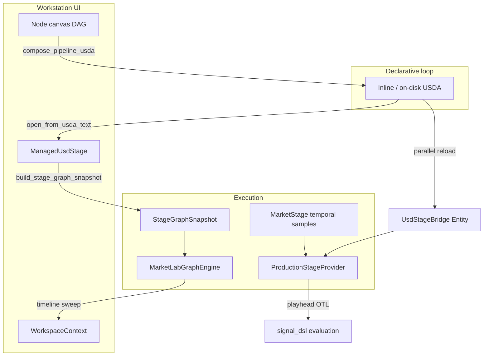

# OpenUSD Integration & Architecture Blueprint

**Status:** Canonical boundary guide for structural vs temporal planes  
**Last aligned with codebase:** June 2026 (Milestones 1–2 + taxonomy library landed)  
**Related:** `.cursor/rules/MarketLab Agent Technical Brief.md` (agent onboarding), `.cursor/rules/genuine, pure-Rust native OpenUSD.md` (split-plane mandate)

---

## 1. Executive Summary

MarketLab uses **OpenUSD** (via the pure-Rust [`openusd`](https://github.com/mxpv/openusd) **0.3.0** crate) as a **file-backed scene graph and relational configuration engine**. It does **not** use OpenUSD as the high-frequency execution substrate for ticks, OHLC bars, or vectorized OTL sweeps.

The system is intentionally split into two planes:

| Plane | Technology | Responsibility |
|-------|------------|----------------|
| **Structural / topological** | `openusd::Stage`, `.usda` layers, `UsdStageBridge` / `ManagedUsdStage` | What nodes exist, schema defaults, wiring (`inputs:sources`, `inputs:underlying`, …), `active`, canvas layout metadata |
| **Temporal / execution** | `MarketStage`, `ProductionStageProvider`, `MarketLabGraphEngine` | Time-sampled OHLCV, playhead evaluation, portfolio ledger, full-timeline vector sweeps |

This split is a **valid and performant** design for a quantitative trading research platform: you get USD’s composition power for strategy topology without paying C++/USD mutation costs on every tick.

---

## 2. What OpenUSD Is—and Is Not—Doing Here

### OpenUSD **is** used for

- **Prim hierarchy** under `/MarketLab` (see `MARKETLAB_ROOT` in `crates/pulsar_marketlab/src/trading_stage/scene.rs`).
- **Financial schema classes** embedded from `pulsar_marketlab_core/resources/usd/schema.usda`: `FinancialAsset`, `OtlOperator`, `OtlTaUberSignal`, `PortfolioIntegrator`.
- **Relationship maps** that define the OTL DAG: `inputs:sources`, `inputs:underlying`, `inputs:constituents`, `inputs:target`.
- **Low-frequency metadata**: `ui:canvas:pos`, `inputs:script_src`, variant tokens, `active` flags, layer stack identifiers.
- **Declarative persistence**: canvas edits recompose to USDA text; the strategy topology survives UI restarts when saved or autosaved.

### OpenUSD **is not** used for

- **Per-tick or per-bar mutation** of millions of samples inside native `Stage` time samples.
- **Primary storage** of execution results from `MarketLabGraphEngine` (those land in `ComputedAttributeStream` / workspace caches, not USD layers).
- **Full native Pcp (Prim Composition Physics)** in Rust—the engine relies on **flattened composed USDA** (and reopen-per-query patterns) rather than implementing a complete USD composition engine in Rust.

---

## 3. Split-Plane Data Flow



### Structural reads

Both `UsdStageBridge` and `ManagedUsdStage` wrap the same constraint documented in code:

```27:31:crates/pulsar_marketlab/src/stage_bridge/usd_spike.rs
/// Send + Sync handle to a composed OpenUSD root layer.
///
/// `openusd::Stage` uses interior mutability and is `!Send` / `!Sync` in 0.3.0.
/// Structural queries reopen the root layer per call (infrequent vs temporal sweeps).
```

Each `with_stage` call **reopens** the root layer path. That is acceptable for UI/compile cadence; it must never sit on the hot path for per-bar inner loops.

### Temporal reads

`MarketStage` (`crates/pulsar_marketlab/src/trading_stage/market_stage.rs`) holds path-keyed prims with `f64` time samples and causal forward-fill. `ProductionStageProvider` routes OTL `MarketProviderServices` across both planes:

- **USD** → prim `active`, structural scalar defaults (`global::…` metadata).
- **MarketStage** → `resolve_attribute_at`, bar windows, execution ledger paths.

See `crates/pulsar_marketlab/src/stage_bridge/production_provider.rs`.

---

## 4. Cold-Path vs Hot-Path (Finance Editor — June 2026)

The **finance blueprint editor** (`marketlab_finance_editor` / `CompileMode::MarketLabFinance`) keeps OpenUSD **off the interactive loop**:

| Tier | Storage | When it runs |
|------|---------|----------------|
| **Hot** | `BlueprintGraph` → Graphy `GraphDescription` → `StageGraphSnapshot` → sweep | Wire edits, slider drags, compile, viewport repaint |
| **Warm** | `FinanceWorkspaceDocument`, `TaxonomyIndex`, `FinanceDatabaseIndex` in RAM | Once per USD import; symbol autofill on node drop / symbol commit |
| **Cold** | `.usda` + sidecars on disk | File → Open / Save only (`marketlab_blueprint_adapter::usd_persistence`) |

`Stage::open` is gated behind [`UsdTransaction`](../crates/marketlab_blueprint_adapter/src/usd_persistence.rs) and increments `stage_open_counter()` for tests/telemetry. **No** debounced `publish_canvas_to_usd_stage` on canvas edits in finance mode.

Legacy workstation debounced sync now calls `sync_graph_after_topology_edit` (snapshot invalidation only) — not a USDA round-trip on every wire tweak.

### Finance I/O flow

1. **Open** — `import_document(path)` → `FinanceWorkspaceDocument` (graph + `session_opinions` + `resolved_prim_paths`) → blueprint canvas. Stage handle dropped after hydration.
2. **Edit** — dirty flag on graph only; disk USDA is stale until Save.
3. **Save** — flush inspector properties → `export_document` writes root `.usda` + workstation sidecars (`schema.usda`, `metadata_library.usda`, empty `session.usda` / `signals.usda` scaffolds).
4. **Symbol autofill** — `finance_asset_properties_for_symbol` reads in-memory taxonomy (+ optional `finance_database_equities.usda` index); **no** `Stage::open` per ticker.

### Verification checklist

- [ ] Edit wire / drag slider / orbit Hydra viewport: `stage_open_counter()` unchanged (profile or log).
- [ ] File → Open `spy_assets.usda`: graph hydrates, Composition Stack shows layer rows, compile succeeds.
- [ ] File → Save → reopen: round-trip Graphy topology + asset metadata.
- [ ] Drop Financial Asset / type `AAPL`: `asset_class`, sector fields autofill without compile.
- [ ] `cargo test -p marketlab_blueprint_adapter usd_persistence` passes.

---

## 5. The Declarative Composition Loop (Legacy Workstation)

MarketLab’s authoring loop is **text-based and recoverable**:

1. **Canvas** — visual DAG (`VisualNode`, `NodeConnection`) in `TradingSystemWorkspace`.
2. **Compose** — `compose_pipeline_usda` / `canvas_compose.rs` emits a root `.usda` layer (optionally with schema sublayer or inline embed).
3. **Reopen** — `UsdStageBridge::open_from_usda_text` and `ManagedUsdStage::open_from_usda_text`.
4. **Hydrate** — `canvas_hydrate.rs` can rebuild canvas nodes from a stage (`hydrate_canvas_from_stage`).
5. **Compile** — `build_stage_graph_snapshot` → `MarketLabGraphEngine::compile_from_stage`.

Entry point for **legacy** live sync: `TradingSystemWorkspace::publish_canvas_to_usd_stage` in `workspace_state.rs` — used for OTL editor commit and File → Save only; routine topology debounce uses `sync_graph_after_topology_edit` without USDA reload.

**Why this matters:** If the UI process crashes, the **true topology** is whatever was last written to USDA on disk (or session autosave), not ephemeral GPUI widget state.

---

## 5. Unified Stage Controller (Milestone 1 — Done)

**Authority:** `WorkspaceContext::usd_stage()` → [`ManagedUsdStage`](../crates/pulsar_marketlab_ui/src/workspace/context.rs)

The workstation no longer keeps a second `Entity<UsdStageBridge>` on `TradingSystemWorkspace`. Canvas publish, file IO, overlays, and graph invalidation all mutate/read the same `ManagedUsdStage`.

| Handle | Role |
|--------|------|
| `ManagedUsdStage` | **Single source of truth** — overlays, edit target, relationships, attributes |
| `UsdStageBridge` | Thin **newtype wrapper** in `stage_bridge/usd_spike.rs` for hydration, USDA export, ledger/tree helpers, and `ProductionStageProvider` fixtures |

`UsdStageBridge::borrow(&ManagedUsdStage)` clones the cheap Arc-backed handle when app code needs explorer/export APIs without a second entity.

**Incremental sync (Milestone 3):** see [`canvas_stage_sync.rs`](../crates/pulsar_marketlab/src/canvas_stage_sync.rs) — wiring-only edits skip full USDA rebuild when prim paths are stable.

---

## 6. Graph Engine Plane (Third Layer)

Beyond playhead `ProductionStageProvider`, the **vectorized** path compiles USD topology into `MarketLabGraphEngine`:

- `build_stage_graph_snapshot` (`pulsar_marketlab_ui/src/workspace/graph_engine.rs`) walks prims under `/`, respects `prim_active`, collects `StageGraphPrim` nodes and `GraphCompileWire` edges.
- Background worker (`begin_graph_engine_timeline_sweep`) runs compile + `execute_timeline` off the UI thread.
- Asset OHLC is supplied separately via `graph_engine_asset_vectors()` — a `HashMap<String, Vec<f64>>` keyed by prim path string, **not** read directly from OpenUSD time samples.

Invalidation: `WorkspaceContext::invalidate_engine_cache` + `install_graph_engine_invalidation_worker` observe context generation bumps.

---

## 7. Path Conventions

Operational instance prims live under:

```text
/MarketLab/<leaf>           # assets, signals, portfolios
/MarketLab/Analytics/...    # analytics helpers (see scene helpers)
```

Schema **template** paths (`/FinancialAsset`, `/OtlOperator`, …) must never appear as composer instances (`SCHEMA_TEMPLATE_PRIM_PATHS`).

Canvas compose assigns stable prim paths from node identity; hydrates map `typeName` back to canvas tiers.

---

## 8. USD Path → Execution Binding (Milestone 2 — Done)

- **Structural identity:** absolute prim path (e.g. `/MarketLab/SPY`).
- **Graph compile:** `build_stage_graph_snapshot` fills `StageGraphSnapshot.path_bindings` (`PathBindingIndex`) and `asset_registry` (`ComposedAssetMeta` per `FinancialAsset` prim).
- **Timeline sweeps:** `graph_engine_asset_vectors()` keys OHLC close columns by **prim path**; `MarketLabGraphEngine` `DataInput` nodes use `prim.path` as the vector lookup key.
- **Temporal plane:** `MarketStage` still holds per-bar samples for playhead OTL via `ProductionStageProvider`.

```text
OpenUSD prim path              → Execution stream
─────────────────────────────────────────────────────────────
/MarketLab/SPY                 → Vec<f64> close column (asset_vectors[prim_path])
/MarketLab/Portfolios/Main     → PortfolioIntegrationResult (graph sweep output)
```

---

## 9. Taxonomy Library (`metadata_library.usda`)

GICS / ETF / exchange class chains live in [`crates/pulsar_marketlab_core/resources/usd/metadata_library.usda`](../crates/pulsar_marketlab_core/resources/usd/metadata_library.usda).

At **compose time**, `flatten_asset_metadata` in [`taxonomy.rs`](../crates/pulsar_marketlab_core/src/taxonomy.rs) resolves multi-inheritance defaults and writes flattened `inputs:category`, `inputs:sub_category`, `inputs:exchange_mic`, etc. onto each `FinancialAsset` prim (native Rust composition does not flatten class stacks).

On-disk saves co-locate `schema.usda` + `metadata_library.usda` sidecars (`ComposeOptions.include_metadata_sublayer`).

---

## 10. Production Milestones

### Milestone 1 — Unified stage controller ✅

- `WorkspaceContext::usd_stage()` is the only workstation authority.
- `publish_canvas_to_usd_stage` reloads one context + restores `RuntimeOverlaySnapshot`.

### Milestone 2 — Path binding protocol ✅

- `StageGraphSnapshot.path_bindings` + prim-path-keyed `asset_vectors`.
- `asset_registry` for composed asset metadata at compile time.

### Milestone 3 — Incremental structural edits ✅

**Goal:** Avoid rebuilding the entire root layer on every canvas wire or parameter tweak.

**Behavior:**

| Trigger | Path |
|---------|------|
| Stable topology (same nodes/paths, prims exist on stage) | `apply_incremental_canvas_sync` — relationship + scalar overlays on `ManagedUsdStage` |
| New/removed node, path change, missing prim, empty graph | Background `compose_pipeline_usda` + `WorkspaceContext::from_usda_text` reload |

**Debouncing:** `schedule_canvas_stage_sync` coalesces rapid `sync_pipeline_graph` calls with a **100 ms** window before running `sync_graph_after_topology_edit` (in-memory snapshot invalidation — **not** `publish_canvas_to_usd_stage`).

**Entry points:** `crates/pulsar_marketlab/src/canvas_stage_sync.rs`, `workspace_state.rs` (`schedule_canvas_stage_sync`, `publish_canvas_to_usd_stage`).

Disk save / file open still emit full USDA (declarative truth on disk).

---

## 11. Module Map (Ground Truth)

| Concern | Location |
|---------|----------|
| USD bridge (app entity) | `crates/pulsar_marketlab/src/stage_bridge/usd_spike.rs` |
| Split-plane OTL provider | `crates/pulsar_marketlab/src/stage_bridge/production_provider.rs` |
| Managed stage + overlays | `crates/pulsar_marketlab_ui/src/workspace/context.rs` |
| Graph snapshot + sweep | `crates/pulsar_marketlab_ui/src/workspace/graph_engine.rs` |
| Canvas → USDA | `crates/pulsar_marketlab/src/canvas_compose.rs` |
| Incremental stage sync | `crates/pulsar_marketlab/src/canvas_stage_sync.rs` |
| USDA → canvas | `crates/pulsar_marketlab/src/canvas_hydrate.rs` |
| Publish / dual reload | `crates/pulsar_marketlab/src/workspace_state.rs` (`publish_canvas_to_usd_stage`) |
| Temporal stage | `crates/pulsar_marketlab/src/trading_stage/market_stage.rs` |
| Path conventions | `crates/pulsar_marketlab/src/trading_stage/scene.rs` |
| Financial schema | `crates/pulsar_marketlab_core/resources/usd/schema.usda` |
| Taxonomy library | `crates/pulsar_marketlab_core/resources/usd/metadata_library.usda` |
| Taxonomy flattening | `crates/pulsar_marketlab_core/src/taxonomy.rs` |
| Graph engine core | `crates/pulsar_marketlab_core/src/orchestration/engine.rs` |

---

## 12. Rules for Contributors

1. **Never** write high-frequency OHLC into OpenUSD layer time samples on the render or sweep hot path.
2. **Always** treat USDA as the structural source of truth for topology and wiring.
3. **Prefer** extending `ManagedUsdStage` overlay APIs over adding another stage wrapper.
4. **Keep** prim paths stable across compose → hydrate → compile; breaking path identity breaks asset vector maps and charts.
5. **Do not** nest executable prims under portfolio parents in USDA; canvas topology is expressed only via `inputs:sources` / `inputs:underlying` relationships between **flat** `/MarketLab/{leaf}` siblings (see §14.3).
5. **Consult** SRD files under `.cursor/rules/` for intent, but **`crates/` wins** on behavior disputes.

---

## 13. Document Maintenance

Update this file when:

- `openusd` crate version or `Stage` Send/Sync story changes.
- Incremental sync debounce interval or intent protocol changes.
- Composition loop steps change (e.g. incremental edit API).

Do **not** duplicate this content into transient cleanup plans; link here instead.

---

## 14. Graph Execution and Compilation

These rules govern the OTL timeline sweep hot path in `pulsar_marketlab_core`.

### 14.1 Zero allocations in sweeps

- **Activation boundary:** `MarketTimelineWindow::activate` (and `MarketLabGraphEngine::activate_timeline`) may allocate once: padded `Arc<[f64]>` columns, `Arc<str>` prim-path keys, and slot tables.
- **Compile boundary:** `MarketLabGraphEngine::compile_otl_scripts` bakes OTL tier engines and signal/portfolio closures into `tier_sweep_cache` before any sweep.
- **Sweep hot path:** `MarketLabGraphEngine::sweep` reuses `TimelineSweepScratch` (`node_outputs`, `streams`, `upstream_scratch`) and must not clone `execution_levels` per bar or allocate closure trees inside the per-level node loop.
- **Convenience API:** `execute_timeline` clones asset vectors once, activates the window, then calls `sweep`.

Implementation: [`engine.rs`](../crates/pulsar_marketlab_core/src/orchestration/engine.rs), [`market_timeline_window.rs`](../crates/pulsar_marketlab_core/src/engine/market_timeline_window.rs).

### 14.2 Strict lookback isolation

Signal and portfolio code that reads historical bars must treat frame `&lt; 0` as out-of-range:

| API | `frame &lt; 0` | `frame ≥ timeline_len` | Unknown path |
|-----|----------------|------------------------|--------------|
| `MarketTimelineWindow::price_at_path` | `0.0` | `0.0` | `0.0` |
| `MarketTimelineWindow::price_at_path_opt` | `None` | `None` | `None` |
| `AssetQuote::price_at_frame` | `0.0` | `0.0` (via `price_at`) | N/A |

No unchecked indexing on lookback offsets.

### 14.3 Cache-aligned path keys

- Keys in `MarketTimelineWindow::price_vectors` are **exact** absolute prim paths as emitted by canvas compose (e.g. `/MarketLab/SPY`).
- Lookups use `series_at_path(prim_path)` / `slot_for_path` with **no** normalization, trailing-slash trimming, or new `String` keys during `sweep`.
- `DataInput` nodes and `graph_engine_asset_vectors()` must publish vectors under the same prim path strings as `StageGraphSnapshot.path_bindings`.
- Legacy portfolio integration may still fall back via `normalize_asset_quote_key` for symbolic closure IDs; the timeline window itself does not rewrite paths.
- **Compose rule:** `resolve_node_stage_paths` in `canvas_compose.rs` assigns every canvas node `/MarketLab/{leaf}`; `build_nest_forest` only mirrors that flat list in the stage tree UI. Nested paths such as `/MarketLab/Sim_Portfolio_3/Sim_Portfolio_1/QQQ` break `graph_engine_asset_vectors` lookups and produce flat wealth lines.
